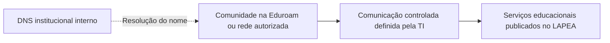
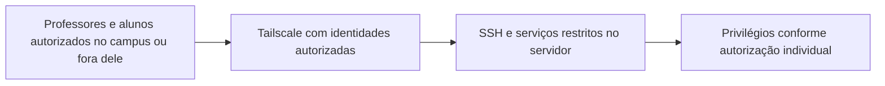

# Infraestrutura

## Inventário fornecido

Origem: transcrição da imagem de inventário fornecida pelo proponente em **7 de outubro de 2026**, no contexto da tarefa. Dados não verificados diretamente no equipamento; versões preservadas tal como fornecidas.

| Item | Informação fornecida |
| --- | --- |
| Sistema operacional | Ubuntu 26.04.1 LTS, x86_64 |
| Instalação | Ubuntu Server, sem interface gráfica, conforme relato |
| Kernel | Linux 7.0.0-38-generic |
| CPU | Intel Core i5-3570 |
| Núcleos / threads | 4 / 4 |
| Frequência | 3,4 GHz; máxima de 3,8 GHz |
| Cache L3 | 6 MiB |
| RAM | Aproximadamente 15 GiB utilizáveis; 13 GiB disponíveis na consulta |
| Swap | 4 GiB, sem uso na consulta |
| Disco | ST3250318AS; 250 GB comerciais, aproximadamente 232,9 GiB |
| Partição principal | EXT4; 15 GiB usados e 201 GiB livres |
| Virtualização | Nenhuma detectada no levantamento fornecido; indicação de máquina física |
| Ferramentas relatadas | Docker, Tailscale e projetos com código vinculado ao GitHub |

Memória disponível não é memória física instalada; espaço livre da partição não é capacidade total do disco. O relato anterior de aproximadamente 1 GB de RAM usado com Docker e algumas ferramentas é observação distinta da imagem. Ambos são registros pontuais, não benchmarks nem garantia de capacidade. Nenhuma divergência de versão foi estabelecida pela leitura dos repositórios de aplicações; novo inventário deve registrar eventuais diferenças sem substituir silenciosamente os dados acima.

O proponente informa possibilidade de funcionamento contínuo e preparação de espaço no laboratório. Cabeamento definitivo, proteção elétrica, existência de nobreak, condições físicas e rotina ainda precisam ser documentados. Permanecer ligado não garante disponibilidade nem substitui backup.

## Modelos conceituais propostos

Os diagramas representam objetivos de acesso, não topologia física levantada nem regras já implantadas.

Não há caminho público WAN solicitado. A conexão comunitária não inclui terminal, sudo ou painéis administrativos do host. Painéis administrativos das aplicações também devem ser inventariados e restringidos conforme finalidade.

## Tailscale: referência técnica, sem diagnóstico local

A conexão pode ser direta ou retransmitida. Quando a conexão direta não é possível, pode usar peer relay, se disponível, ou DERP. Isso continua sendo acesso privado entre dispositivos autorizados e não publicação pública dos serviços. Não se garante conexão direta ou desempenho constante. Fonte: [tipos de conexão](https://tailscale.com/docs/reference/connection-types) e [DERP](https://tailscale.com/docs/reference/derp-servers), consultadas em 07/10/2026.

Como referência para avaliação, a documentação oficial descreve saída TCP 443 para coordenação e DERP, UDP de origem padrão 41641 para conexões diretas e UDP de destino 3478 para STUN. A porta local pode ser reconfigurada. Esses valores são requisitos de referência da ferramenta, **não portas observadas no servidor nem pedido de abertura indiscriminada**. A TI deve avaliar destinos, retornos e regras necessários na infraestrutura real. Fonte: [portas e firewall do Tailscale](https://tailscale.com/docs/reference/faq/firewall-ports), consultada em 07/10/2026.

Após autorização para diagnóstico, os responsáveis poderão registrar o resultado de `tailscale status` e `tailscale netcheck` em anexo restrito para identificar conectividade direta, retransmissão e limitações de rede. Nenhum desses comandos foi executado nesta tarefa.

## Docker e filtragem

Em redes bridge, Docker cria regras para publicar portas e encaminhar tráfego. A documentação oficial alerta que portas publicadas podem contornar as regras usuais do UFW. Portanto, instalar Docker ou ativar firewall não comprova o isolamento proposto. Será necessário conferir mapeamentos, endereços de escuta, backend de filtragem e acesso real pelas diferentes origens. Fonte: [Docker — packet filtering and firewalls](https://docs.docker.com/engine/network/packet-filtering-firewalls/), consultada em 07/10/2026.

A situação real de firewall, interfaces, VLANs, sub-redes, IP e DNS permanece a confirmar. Dados de cadastro do equipamento e detalhes sensíveis devem ser encaminhados por canal restrito à TI.
